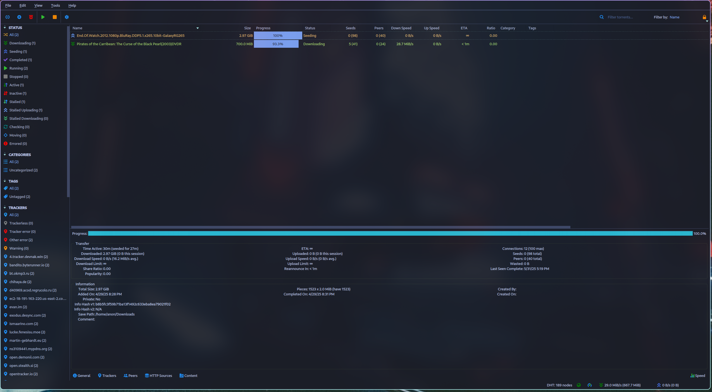

# QBittorrent Tokyo Night Theme
[qBittorrent](https://qbittorrent.org/) is a cross-platform free and open-source BitTorrent client.

## Credits

This theme code is based on [this example](https://github.com/MahdiMirzadeh/qbittorrent).
Utilizing the color scheme from [Tokyo Night Theme for VS Code](https://github.com/tokyo-night/tokyo-night-vscode-theme).

## Note

> [!NOTE]
> This theme was created quickly and not all parts of the interface have been thoroughly tested. If you notice any issues, please report them or submit a correction. Cheers!

---

## Application Theme (Client)

### Usage
1. Download the Tokyo Night theme:
- [tokyo-night](./tokyo-night.qbtheme)

2. Go to your qBittorrent application:
   1. Enable theme selection from menu. (Tools -> Options -> Behavior -> Interface -> Use custom UI Theme)
   2. In `UI Theme file` click on the file icon and in the file picker, select your `.qbtheme` file. 
   3. Restart qbittorrent to apply theme.

### Screenshots
> tokyo-night.qbtheme


---

## WebUI Theme (Server)

### Usage

1. Clone the repository:
    ```
    cd /opt
    git clone https://github.com/milutinke/qBitTorrent-Tokyo-Night-Theme.git
    chmod -R 777 qbittorrent
    ```
2. Enable theme selection from menu: → Tools → Options → Web UI → Use alternative Web UI.
3. In 'Files locations' bar, you should type `/opt/qbittorrent/webui` .

#### Troubleshooting WebUI Theme (Server)
If you found you have put the file/folder in the wrong spot and get the error `Unacceptable file type, only regular file is allowed`
* Append the following after the url/port in your browser and then refresh (this clears the webui setting back to disabled):
```
/api/v2/app/setPreferences?json=%7B%22alternative_webui_enabled%22:false%7D
```